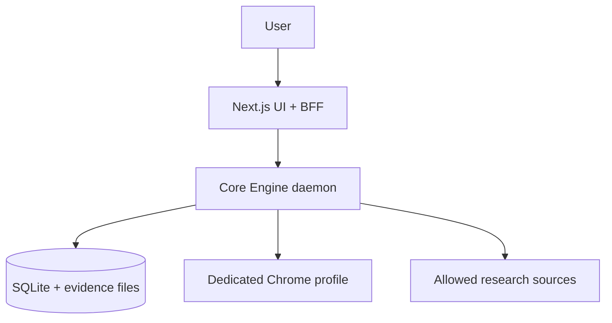
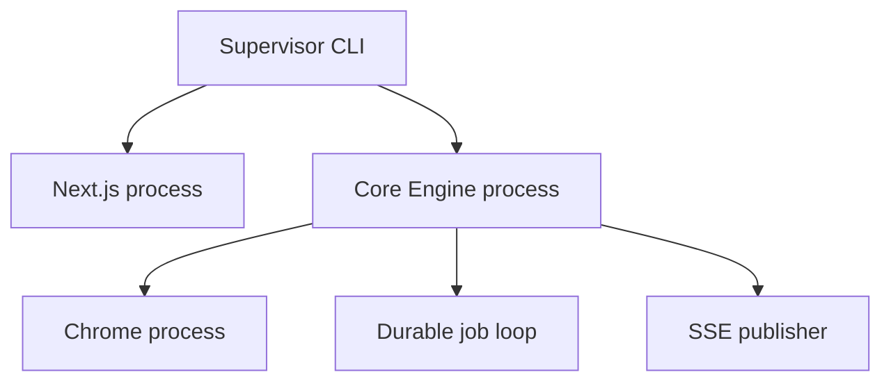
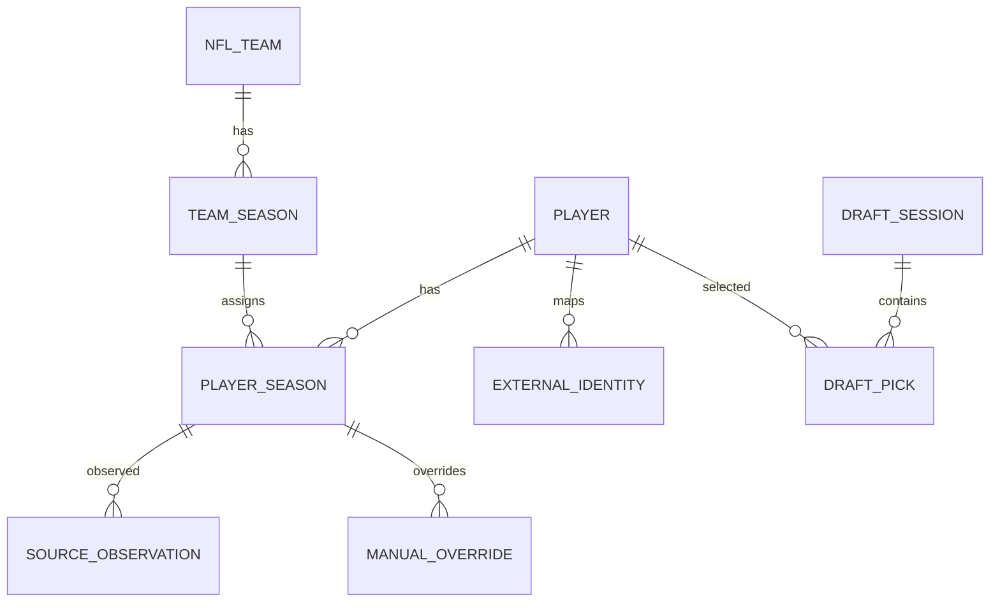
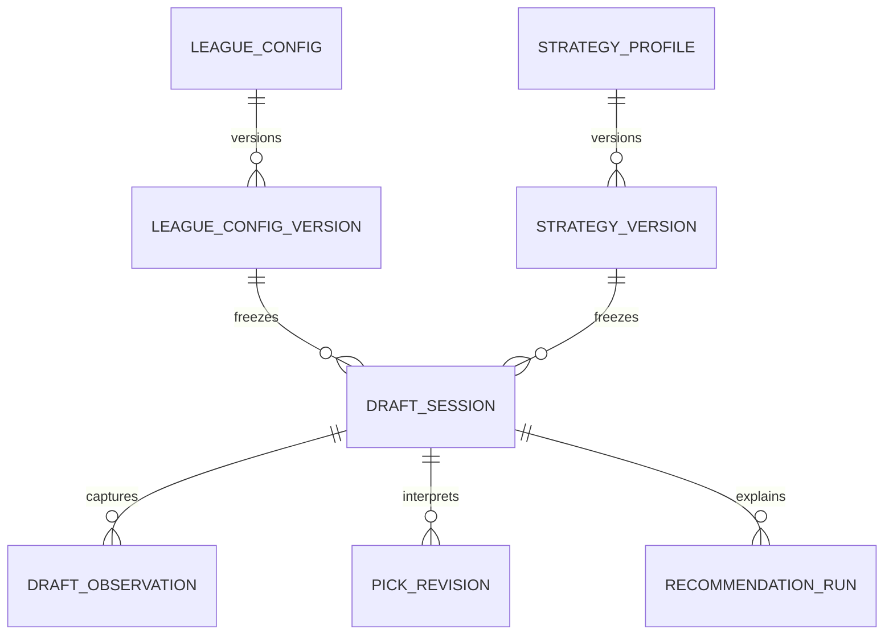
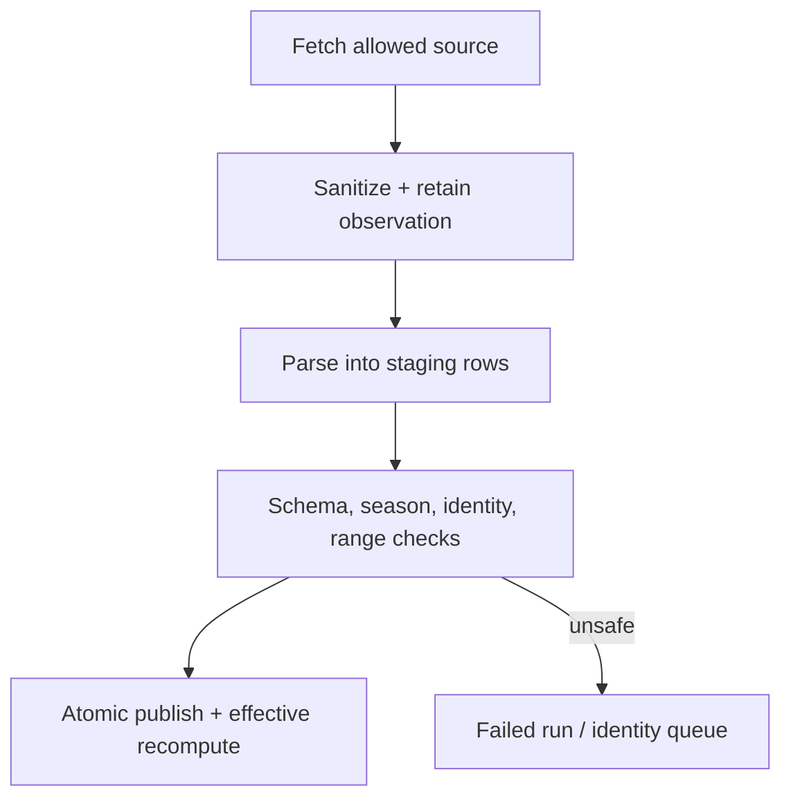
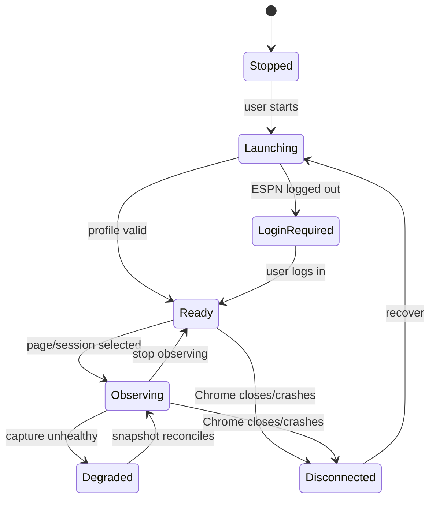
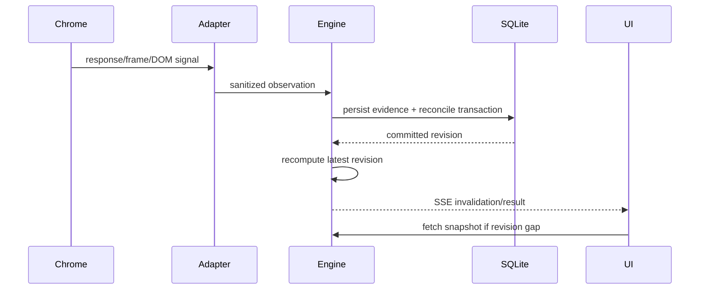
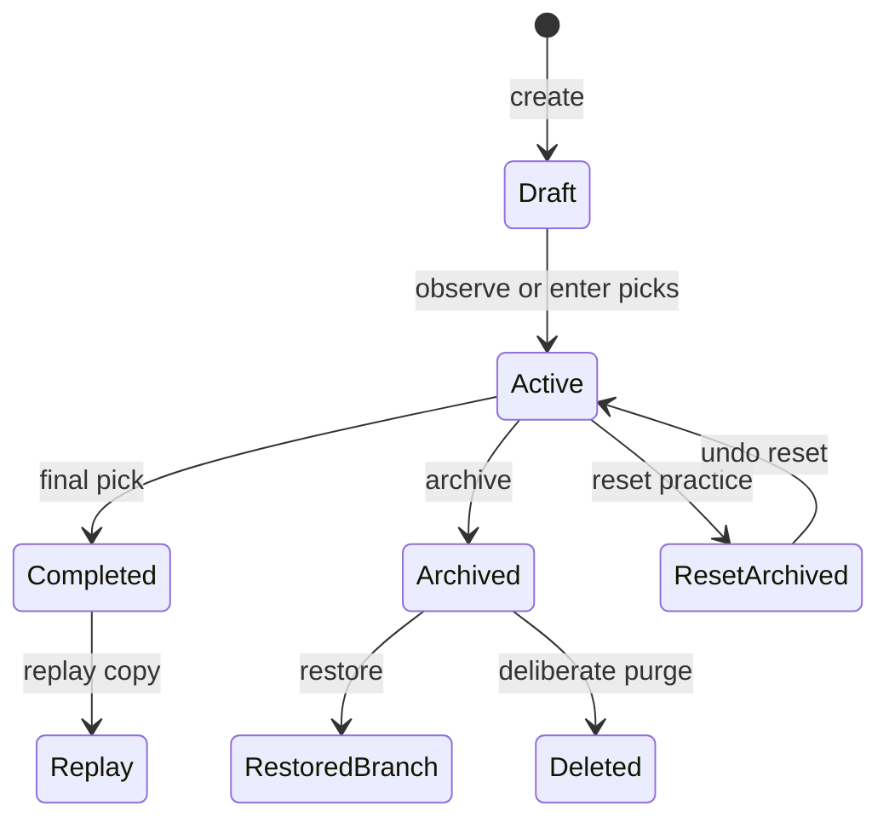
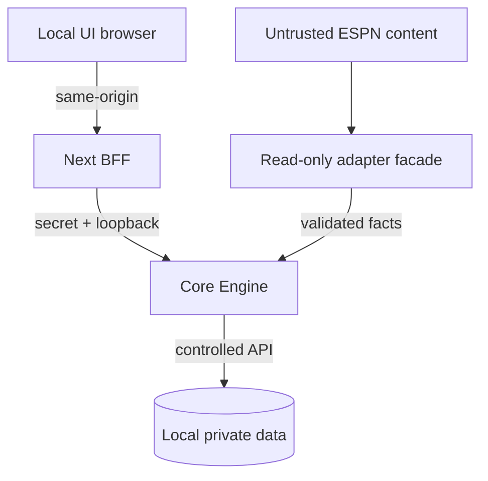

# Local Fantasy Draft Assistant: System Design

**Status:** Proposed v1

**Date:** 2026-08-27

**Input:** `fantasy-draft-assistant-requirements-v1.md`
**Target:** Personal, local-only, open-source GitHub repository using Next.js + TypeScript + SQLite, initially macOS/Google Chrome/ESPN

## 1. Executive decision

Build the product as three supervised local processes in one TypeScript monorepo:

1. A small **supervisor CLI** owns startup, shutdown, per-install paths, process locks, migration/backup preflight, and crash recovery.
2. A persistent **Core Engine daemon** is the only database writer and the only process allowed to control the dedicated Chrome profile. It owns the ESPN adapter, raw capture, normalization, reconciliation, durable jobs, recommendation calculation, audit, and server-sent event publication.
3. A **Next.js App Router web process** owns presentation and acts as a thin same-origin backend-for-frontend. It never controls Chrome, runs durable work, or reads SQLite directly.

Use SQLite in WAL mode with foreign keys enabled and checked-in SQL migrations. Store current query-friendly state alongside append-only evidence and revision history. Do **not** event-source the entire product. Event-like history is justified only for external observations, pick revisions, and change history.

Use Playwright to launch installed Chrome with a dedicated persistent `userDataDir`. Attach passive network/WebSocket listeners, take periodic snapshots from already-rendered page state, and retain DOM parsing as a fallback. Never submit a selection or copy browser cookies into application storage.

Use a deterministic, versioned recommendation function. It scores every available player from typed inputs and emits the complete factor breakdown, warnings, and counterfactual alternatives. Recalculate the whole available pool after each material change. At this scale, full recomputation is simpler and safer than a dependency graph or incremental scoring engine.

### Scope guardrails

This is self-serving software for one owner on one computer. It is source-run from a personal open-source GitHub repository. The architecture must not anticipate a hosted product.

- No accounts, RBAC, tenancy, remote access, cloud sync, hosted database, managed queue, telemetry service, or deployment platform.
- No multi-user or commercial-distribution roadmap.
- No legal/compliance workstream, policy gate, consent system, audit certification, or source-authorization release gate.
- The ESPN adapter is a normal local feature. It remains observation-only because automatic drafting is explicitly outside the product, not because of a distribution policy.
- No CAPTCHA handling, protection bypass, cookie extraction, hidden credential use, aggressive polling, or automatic picks. These are reliability, account-safety, and scope constraints.
- Simulator, replay, import/export, research, recommendations, and manual live entry remain independently useful when ESPN changes or is unavailable.

## 2. Requirements interpretation

### 2.1 Hard invariants

| ID | Invariant | Enforcement |
|---|---|---|
| I-1 | At most one current authoritative selection exists for `(session_id, overall_pick)` | Primary key on `draft_picks(session_id, overall_pick)` |
| I-2 | A player cannot be actively drafted twice in one session | Unique index on `(session_id, player_id)` |
| I-3 | Raw evidence is never rewritten to make a normalized result look correct | Append-only observation rows; payload hash; corrections create new revisions |
| I-4 | A manual correction outranks automated interpretations until explicitly removed or superseded | Locked manual revision plus reconciliation precedence rule |
| I-5 | A draft uses immutable league and strategy versions | Session foreign keys to immutable version rows |
| I-6 | Reset cannot destroy player intelligence or the prior draft | Reset archives the old session and creates a fresh lineage child in one transaction |
| I-7 | One engine owns a data directory; one observer owns a live session; one process owns the Chrome profile | OS process lock, engine singleton, session lease, Playwright/Chrome profile lock |
| I-8 | No automated ESPN side effect is possible in v1 | Adapter package exposes observation interfaces only; no click/type tool in its runtime boundary |
| I-9 | Published UI events never describe uncommitted state | Engine emits only after commit; every event carries the committed aggregate revision |
| I-10 | Source refresh never silently replaces an active user override | Separate source observations and override tables; effective-value resolver |

### 2.2 Explicit assumptions

- One user and one active draft on one computer; multiple historical, simulated, or replay sessions.
- One active browser observer at a time in v1. A second UI tab is allowed because it does not own the observer.
- A season has roughly 500 relevant players, tens of teams, at most a few hundred picks per draft, and fewer than 100,000 raw observations/season under normal retention.
- Normal passive capture traffic is below 10 observations/second. The system is latency-sensitive but not throughput-intensive.
- Runtime support targets the user's macOS machine. Windows and Linux packaging are out of scope; path, lock, and process-liveness code should still be isolated from domain logic so macOS-specific details do not leak everywhere.
- Internet loss is expected. It disables external refresh and ESPN observation but not local data, manual draft entry, simulation, replay, or recommendations.
- Research sources are individually configured adapters. The application does not crawl or auto-discover arbitrary websites.
- Exact league settings remain editable until verified. A live session freezes a version when observation starts.

### 2.3 Quality priorities

**Must optimize:** correctness of draft state, fast recovery, manual continuity, evidence retention, understandable recommendations, safe practice reset, and data/Chrome privacy.

**Nice to optimize:** sub-second updates, broad source coverage, predictive sophistication, multi-platform adapters, and cross-device access.

### 2.4 Rough capacity and latency budget

A 14-round, eight-team draft has 112 selections. Even retaining 20 observations per pick produces only 2,240 observation rows/session. Fifty practice drafts remain small. A full recommendation pass over 300 available players with tens of scalar factors is trivial on a laptop; the design target is **p95 under 250 ms** for computation after warm-up, validated by benchmark rather than assumed.

For the two-second observed-pick target:

| Stage | Target p95 |
|---|---:|
| Passive capture or snapshot discovery | 750 ms |
| Parse, identity resolution, validation | 250 ms |
| Reconcile and commit | 150 ms |
| Recommendation recompute | 350 ms |
| SSE delivery and UI render | 250 ms |
| Contingency | 250 ms |
| **Total** | **2,000 ms** |

Correctness wins if confidence is low: surface a conflict inside the budget rather than apply a guessed player identity.

## 3. Current technology findings

- Playwright's `launchPersistentContext(userDataDir)` explicitly persists cookies/local storage and returns the sole browser context. Its documentation also says browsers do not allow two instances with the same data directory and warns not to automate the user's normal Chrome profile. This directly supports a dedicated app-owned profile. [Playwright BrowserType](https://playwright.dev/docs/api/class-browsertype)
- Since Chrome 136, remote-debugging switches are ignored for the default Chrome data directory unless a non-standard `--user-data-dir` is supplied. The dedicated profile is therefore both a security requirement and a compatibility requirement. [Chrome remote-debugging change](https://developer.chrome.com/blog/remote-debugging-port)
- Playwright exposes HTTP request/response and WebSocket frame events. CDP exposes lower-level WebSocket frame events if Playwright's higher-level API is insufficient. Both are capabilities, not stable ESPN contracts. [Playwright networking](https://playwright.dev/docs/network), [Chrome DevTools Protocol Network domain](https://chromedevtools.github.io/devtools-protocol/tot/Network/)
- SQLite WAL permits readers and a writer to proceed concurrently, but SQLite still has only one simultaneous write transaction. Centralizing writes in the engine avoids needless contention. [SQLite WAL](https://sqlite.org/wal.html), [SQLite transactions](https://sqlite.org/lang_transaction.html)
- SQLite foreign-key enforcement is not safely assumed from defaults; every engine connection must issue `PRAGMA foreign_keys=ON`. [SQLite FAQ](https://sqlite.org/faq.html#q22)
- `VACUUM INTO` creates a consistent compact snapshot of a live database and is suitable for user-triggered local backups. [SQLite VACUUM INTO](https://sqlite.org/lang_vacuum.html#vacuuminto)
- Next.js supports self-hosted streaming, but that does not make a request handler a durable worker. The design uses Next only as presentation/BFF and keeps all ownership loops in the engine. [Next.js self-hosting](https://nextjs.org/docs/app/guides/self-hosting)
- Fastify supports schema-based request validation/response serialization. Zod 4 can emit JSON Schema, allowing one contract package to provide runtime validation and TypeScript inference. [Fastify validation](https://fastify.dev/docs/latest/Reference/Validation-and-Serialization/), [Zod JSON Schema](https://zod.dev/json-schema)
- Node's built-in `node:sqlite` remains release-candidate stability as of this review. Use the established synchronous `better-sqlite3` driver behind Kysely for v1, and hide it behind the repository interface so a later driver change is mechanical. Kysely's built-in SQLite dialect uses `better-sqlite3`. [Node SQLite](https://nodejs.org/api/sqlite.html), [Kysely SQLite setup](https://kysely.dev/docs/getting-started), [better-sqlite3](https://github.com/WiseLibs/better-sqlite3)

Versions must be pinned in the lockfile and verified in CI. This design intentionally does not depend on an exact transient package version.

## 4. High-level architecture





### 4.1 Component responsibilities

| Component | Owns | Does not own | Failure behavior |
|---|---|---|---|
| Supervisor CLI | Data-directory lock, ports, shared secret, process launch, health preflight, coordinated shutdown | Domain state | Restarts web independently; restarts engine only after lock/liveness checks |
| Next.js UI/BFF | React UI, shadcn components, table virtualization, same-origin API and SSE proxy | SQLite, Chrome, durable jobs, reconciliation | UI can restart or close without stopping capture |
| Core Engine | Domain commands, only SQLite write connection, jobs, adapters, recommendations, browser lifecycle | Rendering | Restarts from database, observation history, and browser state |
| ESPN adapter | Page identification, capture, adapter schemas, confidence/provenance | Authoritative state, recommendation policy | Quarantines incompatible payloads; manual mode remains available |
| Source adapters | Fetch/parse to staging schemas, source metadata, cursors | Effective-value precedence | Failure marks run failed without publishing partial values |
| Reconciler | Candidate facts, precedence, invariants, conflicts, current picks | Network/DOM details | Rejects unsafe deltas; schedules full snapshot/manual resolution |
| Recommendation engine | Versioned deterministic scores, explanations, alternatives, bye-week effect | Player identity, source ingestion | Uses last valid inputs and displays freshness warnings |
| SQLite/evidence store | Durable truth, history, leases, blob references | Browser credentials | WAL recovery on process crash; verified backup/restore path |

### 4.2 Why the worker is separate from Next.js

Putting the observer in a route handler couples browser ownership to HTTP request lifecycle, development hot reload, and web-process restart. A custom Next server would combine lifecycles but not remove that coupling. A separate engine is the smallest boundary that satisfies “observation survives UI-tab closure,” isolates Chrome crashes, and establishes a single database writer.

The engine is not a microservice deployment. It is one local process with modules and one embedded database. No Redis, Kafka, Temporal, container orchestrator, or cloud service is justified.

### 4.3 Local communication and security

- Both processes bind only to `127.0.0.1`, never `0.0.0.0`.
- The engine uses an ephemeral port and a per-launch 256-bit bearer secret passed to the Next server through its environment. The browser never receives this engine secret.
- The browser talks only to the same-origin Next BFF. The BFF proxies typed commands and SSE to the engine.
- Both services reject unexpected `Host` and `Origin` values. Mutations require JSON, a same-origin CSRF token, and an idempotency key.
- The supervisor writes its runtime descriptor with owner-only permissions and deletes it on clean shutdown. It contains ports and process nonces, not ESPN credentials.

This prevents a random web page from using the local API through form POSTs, CORS mistakes, or DNS rebinding.

## 5. Repository and runtime layout

```text
fantasy-draft-assistant/
├── apps/
│   ├── web/                       # Next.js App Router + shadcn UI
│   ├── engine/                    # Fastify API and persistent runtime
│   └── cli/                       # supervisor/start/stop/doctor/backup
├── packages/
│   ├── contracts/                 # Zod schemas, API/event contracts
│   ├── domain/                    # entities, commands, invariants
│   ├── db/                        # Kysely types/repos + checked-in SQL migrations
│   ├── recommendation/            # versioned deterministic scoring
│   ├── adapter-sdk/               # source/draft adapter interfaces
│   ├── espn-adapter/              # local ESPN observation implementation
│   ├── simulator/                 # seeded deterministic drafts
│   └── fixtures/                  # sanitized fixture manifests
├── tests/
│   ├── contract/
│   ├── integration/
│   ├── replay/
│   └── failure/
├── docs/
│   ├── adr/
│   ├── runbooks/
│   └── data-dictionary.md
├── migrations/
│   └── 0001_initial.sql
├── .gitignore                     # DB, profile, evidence, logs, exports, backups
├── .env.example                   # non-secret local defaults only
├── LICENSE                        # owner-selected open-source license
├── README.md                      # macOS setup, Chrome flow, run/recovery steps
├── pnpm-workspace.yaml
└── package.json
```

Per-install data lives outside the repository:

```text
<app-data>/fantasy-draft-assistant/
├── app.sqlite
├── app.sqlite-wal
├── chrome-profile/
├── evidence/<capture-set>/<sha256>.json.gz
├── exports/
├── backups/
├── diagnostics/
└── runtime/                       # locks and process descriptor
```

Directory permissions are owner-only where the OS supports it. Git ignores these names as defense in depth, but the primary control is keeping them outside the repository.

Intentionally absent: Dockerfiles, Kubernetes/Helm, Terraform, cloud deployment manifests, hosted telemetry configuration, account/authentication packages, and tenancy abstractions.

## 6. Data architecture

### 6.1 Storage model: selective history plus materialized current state

| Data class | Pattern | Reason |
|---|---|---|
| Raw ESPN/source evidence | Append-only metadata + inline/redacted JSON or content-addressed gzip file | Reparse, debug, prove provenance |
| Pick interpretation | Append-only revisions + current `draft_picks` materialization | Audit corrections and query current board quickly |
| Player source values | Field-level observations | Preserve conflicts and source freshness |
| Manual edits | Append-only override revisions; active pointer/status | Precedence, expiry, precise revert |
| Effective player row | Rebuildable materialized snapshot | Fast table/filter/recommendation queries |
| League/strategy config | Immutable version rows | Historical reproducibility |
| Recommendations | Rebuildable current cache + persisted decision snapshots | Fast live UI plus historical explanation |
| Change history | Append-only | Diagnostics, revert, and historical explanation |

Full event sourcing is rejected because it would make ordinary player queries, migrations, deletion, and repair harder without improving the stated invariants.

### 6.2 Core entity relationships





### 6.3 Important tables

Domain identifiers are UUIDv4 values from Node's built-in `crypto.randomUUID()`, stored as text. Sortable IDs are unnecessary at this local volume; ordered feeds use explicit integer sequences. Timestamps are UTC ISO-8601 or integer epoch milliseconds consistently; pick numbers and rounds are integers. Use SQLite `STRICT` tables and `CHECK` constraints.

**Identity and season data**

- `players(id, canonical_name, normalized_name, suffix, created_at)`
- `player_aliases(id, player_id, alias, normalized_alias, source_id, valid_from, valid_to)`
- `external_identities(id, source_id, namespace, external_id, scope_key, player_id, resolution_id)` with unique `(source_id, namespace, external_id, scope_key)`; `scope_key` is a non-null canonical value such as `global` or `season:2026`, avoiding SQLite's multiple-`NULL` uniqueness behavior
- `identity_cases(id, source_record_ref, candidate_json, status, resolution_reason, resolved_player_id)`
- `nfl_teams(id, canonical_code, display_name)`
- `team_seasons(team_id, season, bye_week, offensive_context_json, revision)`
- `player_seasons(player_id, season, team_id, active_status, revision)`
- `player_positions(player_id, season, position, eligibility_source_id)`
- `player_relationships(from_player_id, to_player_id, season, relationship_type, weight, note)`

**Source, overrides, and effective values**

- `sources(id, adapter_key, display_name, enabled)`
- `source_policy_versions(id, version, policy_json, checksum, created_at)`
- `ingestion_runs(id, source_id, season, state, cursor_json, started_at, finished_at, stats_json, error_redacted)`
- `source_observations(id, entity_type, entity_id, season, field_key, value_json, source_id, source_record_id, source_timestamp, observed_at, ingest_run_id, schema_version, payload_hash)`
- `manual_overrides(id, entity_type, entity_id, season, field_key, value_json, reason, starts_at, expires_at, removed_at, revision, created_at)`
- `effective_dataset_revisions(id, season, source_policy_version_id, cause, created_at)`
- `effective_player_seasons(player_id, season, ...wide query fields..., provenance_json, freshness_json, input_revision, dataset_revision_id)`

**Draft state**

- `draft_sessions(id, mode, state, external_platform, external_draft_id, league_config_version_id, strategy_version_id, parent_session_id, restored_from_session_id, revision, created_at, archived_at)`; `strategy_version_id` is the current/default version while periods preserve any explicit practice-draft change
- `session_strategy_periods(session_id, strategy_version_id, effective_from_session_revision, effective_to_session_revision)`
- `draft_observations(id, session_id, mechanism, kind, adapter_schema_version, page_fingerprint, external_draft_id, observed_at, monotonic_seq, dedupe_key, payload_inline, blob_sha256, redaction_version, parse_status)`
- `observation_occurrences(id, observation_id, observed_at, page_fingerprint)` so identical periodic snapshots can share parsing/storage while their repeated receipt remains measurable
- `observation_pick_candidates(id, observation_id, overall_pick, external_player_id, resolved_player_id, drafting_slot, confidence, validation_json)`
- `draft_picks(session_id, overall_pick, player_id, drafting_slot, authority, locked_manual, accepted_revision_id, revision, selected_at)`
- `pick_revisions(id, session_id, overall_pick, player_id, drafting_slot, authority, action, observation_id, supersedes_revision_id, reason, created_at)`
- `reconciliation_conflicts(id, session_id, overall_pick, existing_revision_id, candidate_ids_json, status, resolution_revision_id)`
- `observer_leases(session_id, engine_instance_id, lease_nonce, expires_at, heartbeat_at)`
- `recommendation_runs(id, session_id, session_revision, effective_data_revision, algorithm_version, strategy_version_id, cause, results_json, duration_ms, created_at)`

**Operations**

- `durable_jobs(id, job_type, state, payload_json, attempt, available_at, lease_owner, lease_expires_at, last_error_redacted)`
- `operations(id, operation_type, state, target_id, result_json, undo_of_id, created_at)`
- `audit_events(id, aggregate_type, aggregate_id, action, actor_type, actor_id, correlation_id, before_json, after_json, reason, created_at)`
- `schema_migrations(version, checksum, applied_at)`

### 6.4 Database constraints that matter

```sql
CREATE TABLE draft_picks (
  session_id TEXT NOT NULL REFERENCES draft_sessions(id),
  overall_pick INTEGER NOT NULL CHECK (overall_pick > 0),
  player_id TEXT NOT NULL REFERENCES players(id),
  drafting_slot INTEGER NOT NULL CHECK (drafting_slot > 0),
  authority TEXT NOT NULL CHECK (authority IN ('manual', 'snapshot', 'structured', 'dom')),
  locked_manual INTEGER NOT NULL DEFAULT 0 CHECK (locked_manual IN (0, 1)),
  accepted_revision_id TEXT NOT NULL UNIQUE REFERENCES pick_revisions(id),
  revision INTEGER NOT NULL CHECK (revision > 0),
  selected_at TEXT NOT NULL,
  PRIMARY KEY (session_id, overall_pick),
  UNIQUE (session_id, player_id)
) STRICT;

CREATE UNIQUE INDEX one_external_draft_per_platform
ON draft_sessions(external_platform, external_draft_id)
WHERE external_draft_id IS NOT NULL AND state <> 'deleted';

CREATE UNIQUE INDEX one_active_override_per_field
ON manual_overrides(entity_type, entity_id, season, field_key)
WHERE removed_at IS NULL;
```

Additional checks validate bye week range for the season, draft pick limits against the frozen league configuration in domain code, and permitted state transitions through command handlers. Cross-row invariants that SQLite cannot express declaratively are checked inside `BEGIN IMMEDIATE` transactions.

Query indexes include:

- `effective_player_seasons(season, overall_rank, player_id)` and `(season, primary_position, positional_rank, player_id)`;
- `draft_picks(session_id, player_id)` (also unique) and `(session_id, drafting_slot, overall_pick)`;
- `draft_observations(session_id, parse_status, observed_at)` and unique `(session_id, dedupe_key)`;
- `source_observations(entity_type, entity_id, season, field_key, observed_at DESC)`;
- `audit_events(aggregate_type, aggregate_id, created_at DESC)`;
- `durable_jobs(state, available_at)`.

Verify plans with `EXPLAIN QUERY PLAN` against generated scale fixtures. Do not add speculative indexes to every editable column; table filters may use a bounded in-memory result at this scale, and measured slow paths earn composite indexes.

### 6.5 SQLite runtime policy

At engine startup, before serving traffic:

```sql
PRAGMA foreign_keys = ON;
PRAGMA journal_mode = WAL;
PRAGMA synchronous = FULL;
PRAGMA busy_timeout = 5000;
PRAGMA trusted_schema = OFF;
```

Use one write connection owned by a serialized command executor. Short read connections are permitted for health/exports if needed; they never write. `FULL` is chosen because write volume is tiny and manual edits/session transitions are valuable. If benchmarks prove it harms the live target, `NORMAL` may be evaluated with an explicit acknowledged power-loss window.

Use Kysely for typed query construction over `better-sqlite3`, but keep invariants and migrations in reviewed SQL. The synchronous driver is acceptable because commands and queries are short at this scale; compression, fixture sanitization, simulation batches, and large exports run outside write transactions and may use worker threads. No transaction may remain open across an `await`.

Migrations run under the supervisor before the engine opens normal traffic. The supervisor creates a verified pre-migration backup, applies ordered checksum-verified SQL migrations, runs `foreign_key_check` and a quick integrity check, and only then marks the version bootable. Failed migration does not launch the engine.

### 6.6 Evidence payload storage

Small sanitized payloads are inline JSON. Large DOM or response fixtures use this sequence:

1. Extract only relevant content and redact through an allowlist schema.
2. Canonicalize JSON, hash SHA-256, gzip to a temporary file.
3. `fsync`, rename to `evidence/<capture-set>/<hash>.json.gz` atomically.
4. Insert the observation row referencing the hash.

A crash between steps 3 and 4 leaves an unreferenced blob; startup maintenance may quarantine it after a grace period. The reverse ordering is forbidden because it can create a database reference to absent evidence.

## 7. Player identity and effective-value model

### 7.1 Identity resolution

Resolution order is deliberately conservative:

1. Exact `(source, namespace, external_id, season)` mapping.
2. Exact external ID mapped across a source's documented season semantics.
3. Candidate generation using normalized name, suffix, season, team history, and compatible position.
4. Automatic acceptance only when one candidate satisfies all strong signals and no conflicting external ID exists.
5. Otherwise create an `identity_case`; do not publish the affected pick/value.

Names alone never merge records. Trades reduce team confidence rather than creating a new player. A manual merge/split is recorded in `identity_resolutions` and is reversible; affected effective rows and draft candidates are reprocessed.

### 7.2 Source publication pipeline



Each run is restartable from a cursor or safe to repeat through source-record hashes. Publication is all-or-nothing for the run's logical batch. A source parser change creates a new adapter schema version and may reparse retained observations without refetching.

### 7.3 Precedence and effective values

For each `(entity, season, field)`:

1. Latest active, unexpired manual override.
2. Highest-precedence valid source observation according to a **field-specific** policy.
3. Latest valid observation from a lower-precedence source.
4. Unknown, never an invented default.

Examples: team/bye should normally prefer an official schedule/team source; ESPN identity and fantasy eligibility prefer ESPN; projections use the user's selected provider; editorial labels may be user-only. Precedence policy is versioned.

The materializer writes both the effective scalar and compact provenance:

```ts
type EffectiveField<T> = {
  value: T | null;
  origin: "manual_override" | "source" | "unknown";
  sourceId?: string;
  observationId?: string;
  overrideId?: string;
  observedAt?: string;
  sourceTimestamp?: string;
  freshness: "fresh" | "stale" | "unknown" | "conflicting";
};
```

Removing an override marks it removed; it does not delete it. The materializer immediately reveals the newest valid underlying source value. Reverting an edit creates a compensating override revision so unrelated changes remain intact.

Team assignment and bye week are separate facts. `player_seasons.team_id` resolves to `team_seasons.bye_week`; a team correction invalidates/rebuilds affected player snapshots and recommendations in one command transaction, followed by a revisioned SSE invalidation.

## 8. Browser lifecycle and ESPN adapter

### 8.1 State machine



### 8.2 Ownership and startup

1. Supervisor atomically creates the app data-directory lock with instance nonce, PID, process start time, and health endpoint.
2. If a lock exists, it verifies process identity and nonce. A live owner causes a clean “already running” response; an unverifiable lock requires explicit recovery. PID reuse alone is not trusted.
3. Engine acquires an independent Chrome-profile lock and a database-backed observer lease before launch.
4. Engine calls Playwright `chromium.launchPersistentContext(profileDir, { channel: 'chrome', headless: false })` using only the dedicated app profile.
5. Browser login occurs on ESPN's page. The app never calls `storageState()`, reads cookie values, exports cookies, or stores credentials.
6. Engine enumerates existing/new pages, identifies candidate draft tabs by URL plus adapter page signature, and asks the user if more than one is plausible.
7. Observation begins only after the external draft identity is known or the user explicitly binds the page to a newly created session.

Chrome's own profile singleton is defense in depth, not the primary application lock.

### 8.3 Capture layers

| Layer | Mechanism | Initial trust | Notes |
|---|---|---:|---|
| Structured HTTP response | Passive `page/context.on('response')`; parse allowlisted bodies | High | Endpoint/shape is adapter-versioned and may disappear |
| WebSocket frame | Passive Playwright frame listener; CDP only if needed | High | Store minimal parsed facts, not handshake headers/cookies |
| Full rendered snapshot | Read already-rendered board/roster state in page | High for completeness | Does not initiate extra ESPN requests |
| Incremental DOM mutation | Mutation observer or targeted polling of rendered DOM | Medium | Selector contracts use semantic anchors and fixtures |
| Manual entry/correction | User command | Authoritative | Explicit, auditable, reversible |

“High” means useful to the reconciler after schema and invariant validation, not intrinsically trustworthy. ESPN can change any surface.

Capture listeners are installed on every matching page and reinstalled on navigation. Snapshot triggers:

- immediately after page binding;
- after a structured/DOM candidate, debounced;
- every few seconds while a draft is active, reading local page state only;
- on load, visibility regain, navigation, reconnect, and detected sequence gap;
- on explicit “Reconcile now.”

### 8.4 Adapter boundary

```ts
export interface DraftPlatformAdapter {
  readonly key: string;
  identifyPage(page: ReadonlyPage): Promise<PageIdentityResult>;
  attachPassiveCapture(page: ReadonlyPage, sink: ObservationSink): Promise<Detach>;
  captureRenderedSnapshot(page: ReadonlyPage): Promise<RawObservation>;
  normalize(observation: RawObservation): NormalizeResult;
  health(page: ReadonlyPage): Promise<AdapterHealth>;
}
```

`ReadonlyPage` intentionally exposes inspection/event APIs but no `click`, `fill`, `press`, request routing, or arbitrary evaluation from recommendation code. Limited page evaluation for extracting rendered state lives inside reviewed adapter code and returns schema-validated plain data. This is a reviewed capability boundary, not a claim that TypeScript can sandbox Playwright: CI also instruments the facade and fails if adapter code invokes an input, navigation, request-mutation, or selection path. The shipped adapter contains no auto-pick command or selector.

### 8.5 Logged out, closed, or changed ESPN

- Logged out: transition to `LOGIN_REQUIRED`, stop parsing the login page, preserve the session, and tell the user to authenticate in Chrome.
- Closed/crashed Chrome: release the observer lease only after the process/context is confirmed gone; stay in manual mode; relaunch with the same profile on request.
- Adapter mismatch: quarantine unknown payload, mark the adapter `INCOMPATIBLE`, show last successful observation/reconciliation, and switch to manual entry. Do not keep guessing through selector drift.
- Navigation to a different mock: external draft ID mismatch quarantines observations and prompts for session selection. Never auto-merge on league settings alone.

## 9. Draft reconciliation

### 9.1 Principle

Observations are claims. `draft_picks` is the current accepted materialization. Reconciliation is deterministic, idempotent, session-scoped, and transactionally updates pick revisions, current picks, session revision, the recommendation trigger, and change history.



### 9.2 Precedence

1. Active manual correction/entry, locked until removed.
2. Later coherent full snapshot with exact ESPN player identities.
3. Structured incremental HTTP/WebSocket candidate with exact identity.
4. DOM candidate with exact identity.
5. Unresolved-name candidates never become authoritative automatically.

Precedence alone is insufficient. A full snapshot must also pass board-level invariants: matching external draft ID, valid pick range, contiguous prefix where expected, no duplicate player, legal drafting slot according to frozen order, and internally consistent round/direction.

### 9.3 Processing algorithm

```text
persist sanitized raw observation (idempotency key = adapter + draft + payload hash/sequence)
if already normalized: attach occurrence metric and stop
parse under the observation's adapter schema version
resolve every player identity; quarantine ambiguous facts
create candidate facts with provenance and confidence

BEGIN IMMEDIATE
  reload session, current revision, observer lease, frozen configuration
  reject if external draft/session identity mismatches
  validate candidate set and board invariants
  for each affected pick:
    if current pick is manual-locked and candidate differs:
      open/update conflict; do not mutate current pick
    else if candidate equals current:
      attach corroborating provenance; no new pick revision
    else if no current pick and candidate passes threshold:
      append ADD revision; insert current pick
    else if candidate outranks current under precedence and is coherent:
      append CORRECT revision; replace current pick
    else:
      open/update conflict; preserve current pick
  if any current state changed:
    increment session revision
    enqueue recommendation job keyed by session revision
    append change-history event
COMMIT

publish revisioned SSE invalidation
```

The recommendation job is coalescing: if revisions 42–45 arrive before scoring starts, calculate revision 45. A user-turn snapshot is persisted; superseded intermediate runs need not be.

### 9.4 Missed and duplicate events

- Duplicate raw observations share a dedupe key and cannot create a second current pick due to both processing idempotency and database constraints.
- A missing incremental pick appears as a gap. The next coherent full snapshot inserts the missing revision(s) and current rows in one transaction.
- If a late incremental event agrees, it becomes corroborating provenance. If it conflicts with a later full snapshot, precedence and timestamp/sequence rules apply or a conflict is opened.
- Reconciliation after restart scans unprocessed observations and then takes a fresh rendered snapshot. It does not assume the last SSE delivered implies the last database commit.

### 9.5 Manual correction

A manual correction requires `expectedSessionRevision` and an idempotency key. It appends a `MANUAL_CORRECT` revision, replaces the materialized pick, sets `locked_manual=1`, bumps the session revision, and retains every conflicting observation. “Return to automation” removes the lock through another revision and immediately reruns reconciliation against the best evidence.

### 9.6 State delivery

SSE events are ephemeral invalidations/deltas, never the canonical state:

```ts
type DomainEvent = {
  engineInstanceId: string;
  sequence: number;              // process-local diagnostic ordering only
  type: "draft.state.changed" | "recommendations.changed" |
        "observer.health.changed" | "conflict.changed";
  aggregateId: string;
  aggregateRevision: number;
  cause: string;
  changedIds?: string[];
  occurredAt: string;
};
```

SSE is chosen over WebSockets because server-to-browser updates dominate and commands already use HTTP. The engine emits only after the database commit. On connection or reconnection, the client fetches a complete state snapshot and then subscribes with the revision it holds; the engine immediately invalidates it if the current revision differs. A keepalive includes current aggregate revisions, so a lost in-process notification is repaired without a durable event log. The UI applies a delta only when its base revision matches; otherwise it refetches the snapshot.

## 10. Recommendation engine

### 10.1 Why no LLM in v1

Every input is structured and every required output must be reproducible and explainable. An LLM would make numerical consistency, latency, offline use, and historical replay worse. Recommendation prose uses deterministic templates populated from factor contributions. No LLM integration is planned.

### 10.2 Inputs and hard filters

Inputs are a frozen strategy version, league version, current authoritative picks, user's roster, effective player snapshot, source freshness, and algorithm version.

Hard filters remove drafted players, explicit exclusions/do-not-draft players, inactive/non-rosterable players, and positions prohibited by the frozen rules. “Fade” is a penalty, not a hard filter. Locks/targets remain visible even when not top-ranked.

### 10.3 Scoring model

Normalize features within the season/position using clipped percentiles, not arbitrary raw units. Preserve raw values beside normalized ones.

For candidate `p`, roster `r`, current pick `k`, and phase `d`:

\[
U(p)=B_{vorp}+Q_d+V_k+T+S+R-F-C-B_y-U_n
\]

Where:

| Factor | Meaning |
|---|---|
| `B_vorp` | Projected value over a league-specific replacement baseline, adjusted for scoring and eligible slots |
| `Q_d` | Phase quality: `w_reliability(d) × reliability + w_upside(d) × upside` |
| `V_k` | Value/reach relative to current pick and ADP distribution, bounded so ADP cannot dominate talent |
| `T` | Tier-cliff urgency: gap and remaining count before next tier |
| `S` | Positional scarcity under league roster/flex configuration |
| `R` | Roster fit: open starters, flex, portfolio balance, late-round construction policy |
| `F` | Aggregated injury, role, suspension, holdout, age, volatility, and team-context risk not already represented in reliability |
| `C` | Concentration penalty for correlated fragile exposures; positive correlation can be allowed by strategy |
| `B_y` | Incremental bye-week coverage loss, capped and phase-aware |
| `U_n` | Uncertainty/freshness penalty; also emitted as a warning |

The shipped 70/30, 45/55, 25/75, and 10/90 reliability/upside values apply only to `Q_d`, not the whole score. This avoids falsely claiming the entire decision is 70% “safe.” Every other factor has separately editable, bounded weights.

The engine emits raw input, normalized feature, weight, signed contribution, provenance, and freshness for each factor. Top explanations use the largest differentiating contributions against the next alternative, not generic boilerplate.

### 10.4 Survival to next pick

Treat this as an uncertain distribution, not a fake precise percentage.

- Preferred: empirical pick distributions by platform/format/source. Condition on the player being available now and compute `P(pick_number > next_user_pick)`.
- Fallback: ADP plus a documented dispersion model calibrated from historical/mock data.
- No calibrated dispersion: display qualitative bands (`unlikely`, `coin flip`, `likely`) and an explicit low-confidence label.

Use a seeded Monte Carlo simulator for portfolio decisions: simulate the intervening picks under team positional needs and the configured draft order, then compare “take now” versus likely alternative sets at the next turn. Store the model/calibration version and seed with recommendation snapshots.

### 10.5 Bye-week calculation

Do not count matching badges. Measure the incremental ability to fill legal starters.

For each week:

1. Remove drafted roster players on bye or inactive.
2. Solve a small maximum-weight bipartite assignment from remaining players to frozen starting slots, including flex eligibility.
3. Represent unfilled future roster spots with conservative replacement-level placeholders, so early drafts are not treated as already unable to field a lineup.
4. Calculate projected lineup-value loss and genuinely uncovered slots versus the no-bye baseline.
5. Score the candidate by the **incremental** loss from `roster + candidate` versus `roster`.

Then:

\[
B_y(p)=\min(cap_d,\; \lambda_d \times \Delta coverageLoss(p))
\]

Rules:

- Early rounds: small tie-breaker cap; never push an elite player below a lower tier solely for overlap.
- QB/TE backup selection: larger penalty when backup shares the starter's bye because the backup fails its coverage purpose.
- RB/WR: use actual slot/flex matching and replacement depth; overlap alone is not alarming.
- Unknown bye: no invented penalty, but a visible uncertainty warning.
- User may set `λ=0` to disable the penalty.

The UI preview shows before/after heatmap counts, uncovered slots, projected lineup-value loss, and whether the score actually changed rank.

### 10.6 Recalculation and historical fidelity

Trigger on authoritative pick/correction, player/team effective revision, override, strategy change, or relevant source publish. Perform a full pool recalculation with a captured input revision. If inputs change before commit, discard the stale result and rerun.

A session freezes strategy and league versions. The user may explicitly “adopt new strategy version” during a practice draft; that creates a session event and subsequent recommendation snapshots reference the new version. Real sessions default to frozen strategy to prevent accidental mid-draft drift.

`session_strategy_periods` closes the prior period at revision `n-1` and opens the new one at revision `n`. Historical recommendation runs reference the exact version directly, so later edits or adoption cannot rewrite earlier explanations.

## 11. Session lifecycle, reset, restore, and replay

### 11.1 Session state



### 11.2 Reset is branch-and-archive, not deletion

Within one `BEGIN IMMEDIATE` transaction:

1. Verify the exact session ID, expected revision, mode, external ID, and pick count shown in confirmation.
2. Reject reset of an active real-draft session. Real sessions may only be archived unless a separate recovery command is designed later.
3. Mark the old practice session `RESET_ARCHIVED`; do not delete/copy its picks.
4. Create a new empty child session referencing the same league and strategy versions.
5. Move the singleton workspace `active_session_id` to the child.
6. Write `operations` and change-history rows; emit the new revision after commit.

This is atomic and O(1) in draft history size. The archived session itself is the restorable snapshot.

Immediate Undo archives the fresh child and reactivates the parent. If the child has acquired picks, one-click Undo becomes a confirmation that preserves the child in history rather than deleting its new work.

### 11.3 Restore and duplicate

- **Restore** creates a writable branch with copied current picks/corrections inside one transaction and sets `restored_from_session_id`. The archived original remains immutable evidence.
- **Duplicate configuration** creates an empty child with the same immutable league/strategy versions and no picks.
- **Archive** only changes lifecycle status and active pointer; it never deletes observations.
- **Permanent delete** is available only for non-active archived sessions, requires retyping the session name/ID fragment, records a tombstone audit event, and purges session-owned rows/files in a durable cleanup job. Backups may retain it until their documented retention expires.

### 11.4 Replay

Replay creates a separate `mode=REPLAY` branch and feeds sanitized observations to the same normalization/reconciliation code through a virtual clock. Speed affects delivery time, not timestamps or ordering. Writes target only the replay session. The original session ID is rejected by replay command handlers as a defense-in-depth invariant.

## 12. Local API contracts

Shared Zod schemas in `packages/contracts` are the source for frontend types, runtime validation, JSON Schema/OpenAPI generation, and fixture validation. All mutation responses include aggregate revision and audit correlation ID.

### 12.1 Representative endpoints

| Method | Path | Purpose |
|---|---|---|
| `GET` | `/v1/health` | DB, migration, browser, auth, observer, jobs, SSE health |
| `POST` | `/v1/browser/start` | Launch/reuse dedicated Chrome |
| `POST` | `/v1/browser/bind-page` | Bind selected page/external draft to session |
| `POST` | `/v1/draft-sessions` | Create practice/real/simulated/replay session |
| `GET` | `/v1/draft-sessions/:id/state` | Revisioned full draft-room snapshot |
| `POST` | `/v1/draft-sessions/:id/manual-picks` | Add manual pick |
| `PUT` | `/v1/draft-sessions/:id/picks/:pick` | Correct/lock pick |
| `DELETE` | `/v1/draft-sessions/:id/picks/:pick/manual-lock` | Return pick to reconciliation |
| `POST` | `/v1/draft-sessions/:id/reconcile` | Capture/reconcile now |
| `POST` | `/v1/draft-sessions/:id/reset` | Archive + create empty child |
| `POST` | `/v1/operations/:id/undo` | Undo reset/eligible operation |
| `POST` | `/v1/draft-sessions/:id/restore` | Create active writable branch |
| `GET` | `/v1/draft-sessions/:id/recommendations` | Current factorized results |
| `GET` | `/v1/players` | Virtualized table query/filter/sort |
| `POST` | `/v1/overrides` | Create field override |
| `DELETE` | `/v1/overrides/:id` | Remove override |
| `POST` | `/v1/imports/preview` | Validate CSV without mutation |
| `POST` | `/v1/imports/:id/commit` | Publish staged import |
| `GET` | `/v1/events` | Ephemeral SSE invalidations and revision keepalives |

Mutations require:

```ts
type CommandEnvelope<T> = {
  commandId: string;             // client-generated idempotency key
  expectedRevision: number;
  body: T;
};
```

A repeated `commandId` returns the original result. A stale expected revision returns `409 REVISION_CONFLICT` with the current revision and refresh link; the server does not silently apply against newer draft state.

## 13. UI implications

The Draft Room reads one revisioned view model, not many independently timed endpoints. It contains clock/current pick when known, authoritative picks, available player page, roster slot assignment, recommendations, bye heatmap, conflicts, and health timestamps.

Key visual semantics:

- Source value, manual override, effective value, and session-only correction have distinct badges/tooltips.
- Drafted rows remain in the table with a consistent grey treatment by default; “hide drafted” is a filter.
- Unknown/conflicting bye weeks are `?`, not week zero.
- The bye heatmap distinguishes overlap, projected lost value, and uncovered starter slots.
- Connection health separates **Chrome**, **ESPN authentication**, **page attached**, **capture**, **last observation**, and **last successful reconciliation**. One green “connected” dot is insufficient.
- Manual pick entry and “reconcile now” remain visible when automation is degraded.
- Reset confirmation includes session name, mode, external ID, picks, and the new empty session that will become active.

Use TanStack Table + TanStack Virtual beneath shadcn-styled controls for hundreds of rows, pinned columns, keyboard navigation, and column visibility. Treat virtualization and accessibility as acceptance-tested behaviors rather than merely library choices.

## 14. Reliability and operations

### 14.1 SLIs/SLOs for a local product

| SLI | Target | Measurement |
|---|---|---|
| Observable ESPN pick to committed local pick | p95 ≤ 2 s in supported fixture/live environment | Observation source timestamp to draft revision commit |
| Recommendation after committed pick | p95 ≤ 500 ms | Pick commit to recommendation revision commit |
| Duplicate observation correctness | 100% in fixture suite | No duplicate current pick/revision side effect |
| Snapshot repair | 100% for valid recorded gap fixtures | Final materialized board equals snapshot |
| Restart recovery | 100% in crash suite | State/invariants equal pre-crash committed state |
| Reset/undo/restore atomicity | 100% in fault-injection suite | Old or new state, never partial |
| Manual-mode availability | 100% while engine + DB healthy | Synthetic local check independent of ESPN |

These are engineering objectives, not an external uptime promise. The diagnostics UI displays measurements from the current machine.

### 14.2 Failure matrix

| Failure | Detection | Containment | Recovery |
|---|---|---|---|
| Next/UI crash | Supervisor health check | Engine/Chrome continue | Restart web; state snapshot + SSE cursor |
| Engine crash | Supervisor/process exit | SQLite transaction rolls back; Chrome may close | Verify lock, restart, process unhandled observations, fresh snapshot |
| Chrome crash/close | Context/process event | Session remains; manual mode | Relaunch same profile, rebind page, full reconcile |
| ESPN logout | Page signature/auth health | Stop parsing login page | User logs in directly; resume and snapshot |
| Adapter schema drift | Parser validation/error-rate threshold | Quarantine; do not alter current picks | Disable layer, use fallback/manual; add fixture and adapter version |
| Missed observation | Sequence gap or snapshot mismatch | Keep last coherent state | Full rendered snapshot repairs |
| Duplicate observation | Dedupe key/DB uniqueness | No duplicate mutation | Count occurrence; no operator action |
| Conflicting identity | Multiple candidates | Do not publish fact | Manual identity resolution, replay affected observations |
| SQLite busy | Busy timeout/metric | Serialized writer minimizes | Retry whole idempotent command with bounded jitter |
| Disk full | SQLite I/O error/free-space preflight | Roll back; stop capture persistence before losing evidence silently | Free space, verify DB, resume/reconcile |
| Source refresh failure | Durable job/run state | Last effective snapshot stays active | Backoff, resume cursor, manual update |
| SSE disconnect | Client heartbeat/revision gap | State still committed | Reconnect cursor or full snapshot |

Retries wrap complete idempotent units. Never retry an arbitrary subset of a reconciliation transaction.

### 14.3 Backup and restore

- Automatic backup before every migration and configurable daily/launch backup when the database changed.
- User-triggered backup uses `VACUUM INTO` to a new timestamped file, then opens it read-only and runs integrity/foreign-key checks.
- The engine does not start an automatic backup during an active live draft. For a manual backup, its command queue reaches a mutation barrier, evidence cleanup pauses, `VACUUM INTO` captures the database, and the backup copier reads the evidence hashes from that snapshot. New captures may continue afterward but are not part of the completed backup.
- Backup manifest records schema version, database hash, evidence-manifest hash, app version, and creation time. Evidence blobs are hard-linked/copied into a versioned backup bundle as supported.
- Default local retention: last 7 daily, 4 weekly, and all explicit user backups; configurable.
- Restore never overwrites the only working database. Supervisor stops engine, validates backup into a new path, moves current data to a recovery directory, atomically switches, launches health checks, then offers rollback.
- Target RPO: last committed SQLite transaction plus any evidence blob already fsynced. Target RTO: under five minutes for a healthy local backup, excluding browser re-login.

### 14.4 Diagnostics

Structured JSON logs use correlation IDs, command IDs, session IDs, observation IDs, and adapter versions. Headers and payloads are excluded by default.

Diagnostics screen:

- process/app/schema version and migration status;
- database integrity/backup age/WAL size/free disk;
- Chrome PID/profile identity/page URL class, never cookies;
- ESPN auth/page/capture layer health;
- last raw observation, normalized candidate, authoritative pick, and reconcile;
- conflicts, adapter parse failure rate, and event latency histogram;
- durable job attempts and next retry;
- SSE subscribers, current revisions, and notification latency.

An exported bundle contains sanitized logs, schema/migration metadata, health, aggregate counts, adapter versions, and user-selected fixture payloads after a second redaction pass. It omits browser profile, cookies, tokens, raw request headers, and unrelated page content.

## 15. Local safety and data hygiene

This is not a compliance or internet-service threat model. It covers the failures that can realistically hurt a personal local tool: leaking the dedicated Chrome profile into Git or diagnostics, a webpage calling localhost, malformed imports, two local processes corrupting shared state, and accidental destructive actions.

### 15.1 Trust boundaries



### 15.2 Threats and controls

| Threat | Primary controls | If one control fails |
|---|---|---|
| Malicious site calls localhost | Loopback, exact Host/Origin, same-origin BFF, CSRF token, JSON-only mutation | Engine secret never reaches browser; command validation/revision checks |
| Cookie/token leakage | Dedicated profile; no cookie APIs/storage state; header allowlist; redacted evidence | Owner-only filesystem and diagnostic second-pass redaction |
| ESPN content induces action | No LLM/tool loop; read-only adapter type; no selection code | Domain engine accepts only typed observation facts |
| CSV formula/script injection | Strict parsing/limits; render text; neutralize spreadsheet formula prefixes on export | Import preview and transactional rollback |
| Source poisoning | Per-source staging, provenance, range/anomaly checks, no silent publish | Manual override and source disable/rollback |
| Profile concurrency/corruption | App lock + profile lock + Chrome singleton | Refuse ambiguous stale-lock recovery; backup profile metadata |
| Unauthorized LAN access | Loopback only | Engine bearer secret + host validation |
| Dependency compromise | Lockfile, dependency review, minimal adapter privileges | No cloud credentials or hosted infrastructure; local blast radius |
| Resource exhaustion | Payload/body/file limits, bounded capture, job concurrency 1, retention and disk preflight | Stop ingestion first; preserve manual draft path |
| Accidental active-real reset | Mode policy, explicit ID/revision confirmation | Transactional archive history; audit |

### 15.3 Privacy data flow

ESPN account state remains only in Chrome's dedicated profile. The app persists external league/draft IDs, team names if needed, pick facts, and sanitized page evidence. It should avoid league chat, email, profile details, advertisements, unrelated responses, full HAR files, and screenshots by default.

No data leaves the computer except ordinary user-driven ESPN browsing and explicitly configured research-source requests. Do not add telemetry or hosted crash reporting; local diagnostics are sufficient for this repository.

Deletion covers primary DB rows and evidence blobs, but backups retain data until backup expiry. The UI must say this. A “purge now” operation can rebuild eligible backups later, but is not necessary for v1.

## 16. Testing strategy

### 16.1 Fixture recording

Recording is an explicit developer mode, never always-on HAR capture:

1. Capture only adapter-relevant response bodies, WebSocket payloads, and targeted DOM extracts.
2. Drop all request/response headers except a tiny reviewed allowlist.
3. Replace external league/user/team identifiers with stable fixture tokens.
4. Scan for cookies, bearer/basic tokens, emails, account IDs, UUIDs outside allowlist, and high-entropy strings.
5. Fail closed if sanitizer findings remain.
6. Canonicalize, hash, write fixture manifest with adapter schema/app/Chrome versions.
7. Replay the fixture in an isolated temporary data directory and compare expected normalized state.

Never commit a real Chrome profile, raw HAR, or unsanitized page dump.

### 16.2 Deterministic simulator

`packages/simulator` accepts seed, league version, player pool, drafting policies, and a fault script:

```ts
type FaultScript = Array<
  | { atPick: number; kind: "duplicate"; count: number }
  | { atPick: number; kind: "drop_incremental" }
  | { atPick: number; kind: "delay"; milliseconds: number }
  | { atPick: number; kind: "conflicting_dom"; playerId: string }
  | { atPick: number; kind: "disconnect"; durationMs: number }
  | { atPick: number; kind: "restart_engine" }
>;
```

The simulator emits the same raw observation contract as a platform adapter. Golden tests assert both final board and exact recommendation factor snapshots for a fixed algorithm version.

### 16.3 Test layers

- **Unit/property:** snake order, slot assignment, identity normalization, precedence, bye matching, scoring monotonicity, idempotency keys.
- **Schema/contract:** every adapter fixture and API payload against versioned schemas.
- **Database integration:** constraints, migration forward/backward compatibility policy, transaction rollback, revision consistency.
- **Replay:** recorded sanitized ESPN mocks for every supported adapter version.
- **Failure injection:** kill process between observation/file/DB stages, disk full, SQLite busy, stale lock, page refresh, logout, SSE gap.
- **UI:** keyboard/virtualization, greyed rows, unknown bye, manual continuity, reset confirmation/undo.
- **Security:** localhost cross-origin requests, Host spoofing/DNS rebinding cases, CSRF, oversized CSV/JSON, formula export, redaction corpus.
- **Performance:** 1,000 players, 20 seasons, 100,000 observations, concurrent ingestion, full live recommendation budget.

Every failure scenario listed in the requirements maps to at least one named test. Fixtures are the release gate for adapter changes; a live mock is a smoke test, not the only test.

## 17. Delivery plan: risk first

### Phase 0: ESPN observability spike

- Record one manually sanitized mock-draft fixture for local experimentation only.
- Prove installed Chrome persistent-profile reuse with manual login, browser restart, page discovery, passive event capture, and no cookie export.
- Identify whether structured draft facts are observable. Do not bake unknown endpoints into the domain model.
- Exit criteria: one sanitized fixture, reusable login/profile, observed external draft/player IDs or documented DOM fallback, and successful missed-event repair.

### Phase 1: domain kernel and simulator

- Monorepo, contracts, migrations, SQLite pragmas, supervisor lock.
- Player/team/season identity, league/strategy immutable versions.
- Draft sessions, authoritative picks/revisions, manual entry/correction.
- Deterministic simulator and snake-order tests.
- Basic deterministic recommendations and explanations.

This creates a useful manual draft assistant even if ESPN observation never ships.

### Phase 2: player intelligence and editing

- Source observations, override resolver, effective snapshot, audit/revert.
- CSV preview/commit/export, team bye propagation.
- Player table, detail drawer, provenance/freshness, bulk edits.
- Backup/restore CLI and diagnostics.

### Phase 3: session safety and replay

- Reset-as-archive, immediate undo, restore branch, duplicate config.
- SSE invalidations, reconnect snapshots, and the revisioned Draft Room.
- Replay runner and session comparison.

### Phase 4: ESPN adapter

- Read-only adapter boundary, Chrome state machine, external session binding.
- Structured capture where available, rendered full snapshot, DOM fallback.
- Reconciliation/conflict UI and manual degradation.
- Crash/reload/logout/missed/duplicate fixture suite; two-second performance test.

### Phase 5: recommendation depth

- Calibrated ADP survival model and seeded Monte Carlo.
- VORP/replacement baselines, tier cliff, roster/flex fit.
- Maximum-weight bye coverage and before/after visualization.
- Persisted decision snapshots and mock comparison.

### Phase 6: local developer ergonomics

- One-command start/stop/doctor/backup scripts and clear README setup for macOS.
- Fresh-clone setup, Chrome discovery, and previous-schema migration tests.
- Restore drill, diagnostics export, and full acceptance suite.

## 18. Fixed local operating envelope

This design has one operating envelope, not a scale roadmap:

| Dimension | Supported envelope |
|---|---|
| Owner | One person |
| Machine | One local computer |
| Active observer | One Chrome profile and one draft session |
| UI clients | A few local tabs, all on loopback |
| Data | Several seasons, hundreds of players/season, dozens of practice drafts |
| Runtime | One supervisor, one engine, one Next.js process, one Chrome process |
| Storage | One SQLite database plus local evidence/backups |

The application has no recurring infrastructure cost and no hosted dependency. Expected resource costs are local disk, CPU during ingestion/simulation, and any research subscriptions the user independently chooses. Diagnostics track evidence bytes, backup bytes, source requests, recommendation time, and WAL size so a runaway local loop is obvious.

Within this fixed envelope, optimize only when a measured local problem appears:

- recommendation p95 exceeds 250 ms → profile, precompute replacement baselines, then consider one worker thread;
- WAL checkpoint or backup interrupts the Draft Room → shorten read transactions and batch ingestion;
- evidence exceeds the configured local retention budget → expire or archive old raw blobs without changing the database architecture.

`DraftPlatformAdapter` keeps ESPN-specific shapes outside the domain because that is good boundary design, not because other platforms are on the roadmap. Likewise, the data model avoids blocking post-draft workflows, but this document does not design them. Hosted, remote, multi-user, or commercial operation is explicitly out of scope and should not influence implementation choices.

## 19. Alternatives and ADR summary

| Decision | Chosen | Rejected | Why |
|---|---|---|---|
| Durable runtime | Separate local engine daemon | Next route handlers/custom server only | Browser and jobs must survive UI lifecycle; clearer ownership |
| Database | SQLite WAL, one writer | Postgres, IndexedDB, Excel | Local scale and operations; relational invariants; no service dependency |
| Workflow durability | Jobs table + transactions | Temporal/BullMQ/Redis | Tiny local workload; no external broker needed |
| Live transport | SSE + HTTP commands | WebSockets | Predominantly server-to-client; reconnection cursor is simple |
| State history | Selective append-only + materialization | Full event sourcing | Preserve evidence where valuable without global replay complexity |
| Reset | Archive old + new child | Delete rows + backup copy | O(1), naturally restorable, safer lineage |
| Browser | Playwright persistent Chrome profile | Selenium temp profile, extension, cookie import | Required profile reuse and passive event APIs; dedicated profile supported |
| Database access | Kysely + `better-sqlite3`, reviewed SQL migrations | `node:sqlite` while RC; raw SQL everywhere | Stable local driver path with typed queries |
| Recommendation | Deterministic factor engine | LLM/agent | Reproducibility, latency, offline use, transparent factors |
| Recompute | Triggered full pass | Fine-grained incremental graph | Hundreds of candidates; simplicity and correctness win |
| API types | Shared Zod contracts + JSON Schema | Duplicated TS interfaces | Runtime validation for untrusted boundaries plus compile-time types |

## 20. Adversarial review and revisions

### Scope-correction review

| Reviewer | Severity | Finding | Revision |
|---|---:|---|---|
| Product scope | Critical | The prior design turned ESPN terms into a release gate for a self-serving personal repository | Removed the gate and all legal/compliance work; ESPN observation is a normal local feature |
| Simplicity | High | A 1×/10×/100× path anticipated hosted and multi-user systems that will not exist | Replaced it with one fixed local operating envelope |
| Simplicity | Medium | Signing, notarization, SBOM, and commercial-distribution hardening did not serve source-run personal software | Replaced with fresh-clone setup, local scripts, migrations, diagnostics, and restore drills |
| Security | Medium | Removing compliance language must not remove controls that protect local credentials or state | Retained profile isolation, loopback, origin checks, redaction, file permissions, and backups as pragmatic local safeguards |

### Pass 1 findings

| Reviewer | Severity | Finding | Revision |
|---|---:|---|---|
| Staff Engineer | High | Reset implemented as delete/copy would create complex partial-restore paths | Changed to archive old session + create empty lineage child atomically |
| SRE | Medium | An in-memory SSE notification can be lost after commit | Emit after commit; reconnect and keepalive revision checks fetch canonical snapshots, avoiding a local outbox |
| Security | High | Loopback alone does not prevent malicious-origin localhost requests | Added same-origin BFF, engine secret, Host/Origin checks, CSRF, JSON-only commands |
| Privacy | High | Generic HAR capture can retain cookies, account data, and unrelated content | Replaced with allowlisted targeted recorder and fail-closed sanitizer |
| AI security | High | LLM explanations could ingest untrusted news/page text and indirectly steer choices | Removed LLM from v1 decision/explanation path; typed deterministic templates only |
| Cost/performance | Medium | Persisting every recommendation result after noisy research changes creates waste | Coalesce by input revision; persist user-turn/decision snapshots only |
| Simplicity | Medium | Separate ingestion/browser worker processes add coordination without scale need | Kept them as modules/durable loops inside one engine process |

### Pass 2 findings after revision

| Reviewer | Severity | Finding | Resolution |
|---|---:|---|---|
| Staff Engineer | Medium | Restoring by reactivating an old session would mutate historical evidence | Restore now creates a writable branch; original remains archived |
| SRE | Medium | Evidence-file/DB dual write can leave missing blobs | File fsync/rename precedes DB reference; orphan quarantine handles crash gap |
| Security | Medium | Merely omitting auto-pick UI does not prove no side effects | Adapter runtime interface excludes click/type/request-routing APIs; observation-only package boundary |
| Privacy | Medium | Permanent deletion promise conflicts with retained backups | UI and design now state backup retention explicitly |
| Cost/performance | Low | `synchronous=FULL` may add latency | Retain for v1; benchmark and only relax with explicit durability decision |
| Simplicity | Low | Recommendation “incremental” wording could imply dependency engine | Clarified: incrementally triggered, full pool recomputation |

No unresolved architecture-changing Critical/High finding remains within the personal, local-only scope.

## 21. Requirements traceability

| Requirement area | Design control |
|---|---|
| Durable editable intelligence | Source observations, overrides, effective snapshot, audit, CSV staging |
| Persistent Chrome/login | Dedicated Playwright persistent context; profile/app locks |
| Missed/duplicate/restart recovery | Raw evidence, idempotency, coherent snapshots, pick uniqueness, startup replay |
| Live availability/recommendations | Materialized picks, full recompute, revisioned SSE/snapshot recovery, two-second budget |
| Explicit strategy | Immutable strategy versions and factorized deterministic utility |
| Bye weeks | Team-season derivation, lineup-assignment loss, heatmap preview |
| Safe practice lifecycle | Reset-as-archive, operation undo, restored branch, deliberate purge |
| Manual corrections | Optimistic command, locked manual revision, evidence preserved |
| Local-only/private | Loopback/BFF, local SQLite/files, no telemetry, no cookie copy |
| Source traceability | Field observations, adapter/run/schema versions, provenance/freshness |
| Manual degradation | Core domain independent of ESPN adapter; visible manual commands |
| Replay/testing | Sanitized fixture contract, virtual clock, deterministic simulator |
| ESPN isolation | Narrow adapter SDK; no ESPN response/DOM shapes in domain tables |

## 22. Implementation bootstrap

Suggested developer commands once the repository is scaffolded:

```bash
corepack enable
pnpm install --frozen-lockfile
pnpm db:migrate
pnpm test
pnpm test:replay
pnpm dev
```

Built local validation:

```bash
pnpm build
pnpm app:doctor
pnpm start
pnpm app:backup
```

CI must run lint/typecheck, migration-from-each-supported-version, unit/property, DB integration, replay golden tests, local-safety/redaction tests, and fresh-clone smoke tests. Live ESPN tests are never required for ordinary CI and must not use stored credentials.

## 23. Final verdict

The defensible v1 is a local modular monolith with a separate supervised engine, SQLite WAL, a dedicated persistent Chrome profile, append-only external evidence, materialized current state, and deterministic recommendations. It is small enough to build and operate alone while directly enforcing the hard correctness and recovery properties.

The highest-risk assumptions should be tested in this order: stable read-only observability of ESPN draft facts, profile/reconnect behavior, and reconciliation against recorded gaps/conflicts. Build the manual/simulator-first domain kernel before completing the ESPN adapter so a platform change cannot strand the product.

Residual uncertainty remains in ESPN's live page/network shape, the availability and calibration of high-quality 2026 ADP distributions, source freshness, and real-machine Chrome behavior. Resolve those through fixtures, mock drafts, and local profiling. They do not justify hosted infrastructure, multi-user abstractions, or a broader compliance/design program.
